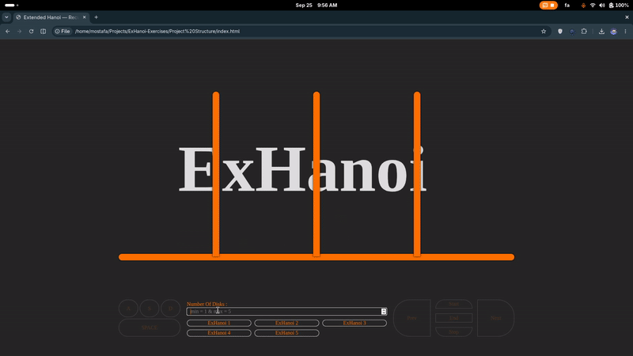

# Extended Hanoi Recursion Lab

An interactive **Data Structures** lab for practicing recursion through the classic Towers of Hanoi problem and five constrained variants.

This repository preserves a starter project that I prepared and published for students while serving as a **Teaching Assistant for Data Structures**. I taught the relevant recursion concepts, guided students through the exercise, distributed it through GitHub, reviewed their implementations, and evaluated their presentations explaining the recursive solutions.

> **Attribution:** The original project was developed by [Aryan Nourbakhsh (@Aryanoor)](https://github.com/Aryanoor). This course version was published and used with his permission.



## Learning objectives

Students were expected to reason about recursive decomposition, base cases, and problem constraints before translating their pseudocode into JavaScript. The visualization and playback controls were provided so they could inspect their algorithms step by step.

The starter code intentionally leaves six algorithmic functions incomplete:

```js
hanoi(from, via, to, n)
exHanoi_1(start, aux, end, n)
exHanoi_2(A, B, C, D, n)
exHanoi_3(A, B, C, n)
exHanoi_4(A, B, C, D, n)
exHanoi_5(A, B, C, D, n)
```

The full exercise specification is in [`ASSIGNMENT.md`](ASSIGNMENT.md).

## Run locally

No package installation or build step is required.

1. Clone or fork the repository.
2. Open `Project Structure/index.html` in a modern browser.
3. Enter a disk count from **1 to 5** and choose an Extended Hanoi problem.
4. Implement the required recursive function(s) in `Project Structure/script.js`.

The interface supports manual and automatic playback. Keyboard shortcuts are `A` for previous, `S` for start, `D` for next, and `Space` for stop.

## Repository structure

```text
.
├── assets/
│   └── demo.gif
├── Project Structure/
│   ├── index.html
│   ├── script.js
│   └── stylesheet/
│       ├── css/
│       └── sass/
├── ASSIGNMENT.md
└── README.md
```

`Project Structure/` is the starter code distributed to students. The recursive functions are intentionally unfinished because implementing them is the exercise.


## Credits

Original project by [Aryan Nourbakhsh (@Aryanoor)](https://github.com/Aryanoor). This course version was published and used with his permission. Course instruction, student guidance, implementation review, and presentation assessment were carried out by [Mostafa Nasrollahpour](https://github.com/MostafaNasrollahpour) as a Teaching Assistant for Data Structures.
